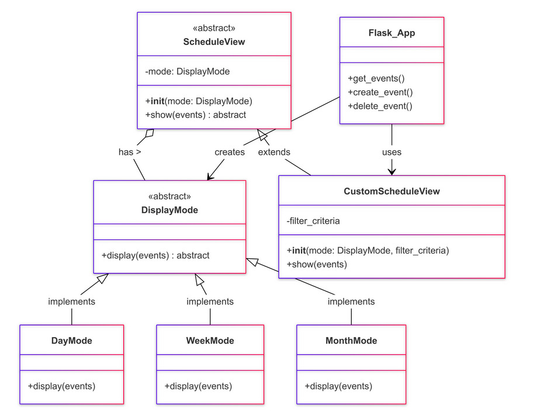
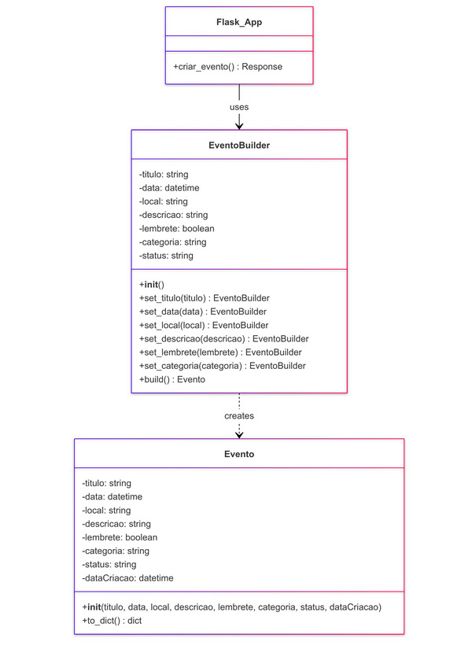

# G6_Agenda

**Código da Disciplina**: FGA0208 
**Número do Grupo**: 6 
**Entrega**: 03 

## Alunos

| Matrícula   | Aluno                                                                                  | 📸                                                                                                         |
| :---------: | :------------------------------------------------------------------------------------: | :-------------------------------------------------------------------------------------------------------: |
| 22/1008801  | [Bianca Patrocínio Castro](https://github.com/BiancaPatrocinio7)                       |      |
| 22/1022248  | [Carlos Eduardo Mota Alves](https://github.com/CADU110)                                |               |
| 20/2016266  | [Gabriel Marques De Souza](https://github.com/GabrielMS00)                             |            |
| 22/1008060  | [Gabriel Moura Dos Santos](https://github.com/thegm445)                                |               |
| 21/1039312  | [Danilo Carvalho Antunes](https://github.com/Danilo-Carvalho-Antunes)                 | |
| 22/1021993  | [Hugo Queiroz Camelo De Melo](https://github.com/melohugo)                             |            |
| 21/1039519  | [João Manoel Barreto Neto](https://github.com/JoaoBarreto03)                           |          |
| 19/0110066  | [Johnny da Ponte Lopes](https://github.com/JohnnyLopess)                               |              |
| 21/1031083  | [Julia Vitoria Freire Silva](https://github.com/juhvitoria4)                           |          |
| 19/0094273  | [Paulo Henrique Rossi de Borba](https://github.com/paulohborba)                        |       |
| 18/0077899  | [Ricardo Augusto Valle Maciel](https://github.com/avmricardo)                          |         |
| 22/1008516  | [Vitor Feijó Leonardo](https://github.com/vitorfleonardo)                              |             |
| 20/0049879  | [Yago Milagres Passos](https://github.com/yagompassos)                                 |                |

## Sobre 

Uma agenda digital eficiente pode transformar a organização do dia a dia, promovendo produtividade e melhorando a gestão de compromissos. Ferramentas como o Google Calendar, que oferece sincronização em tempo real e lembretes personalizados, ajudam os usuários a manterem-se organizados em diferentes dispositivos. Outros exemplos incluem o Trello, que utiliza uma interface visual intuitiva com funcionalidade de arrastar e soltar para organizar tarefas e projetos, e o Microsoft Teams, que permite integrar agendas e eventos para facilitar a colaboração em equipes. Essas referências mostram como a integração e a personalização são essenciais para uma agenda que atenda bem às expectativas dos usuários.

## Screenshots da Terceira Entrega

  

  

## Há algo a ser executado?

( ) SIM

(x) NÃO
